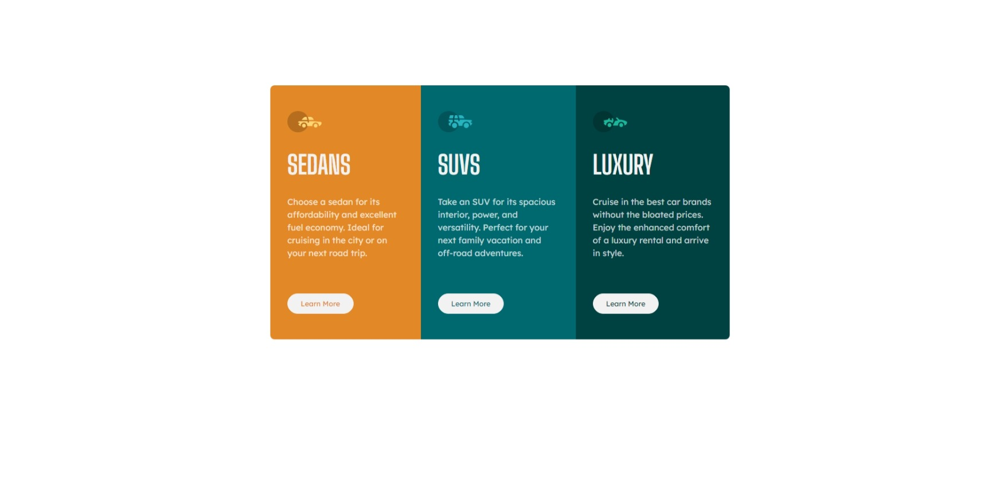

# Frontend Mentor - 3-column preview card component solution

This is a solution to the [3-column preview card component challenge on Frontend Mentor](https://www.frontendmentor.io/challenges/3column-preview-card-component-pH92eAR2-). Frontend Mentor challenges help you improve your coding skills by building realistic projects. 

## Table of contents

- [Overview](#overview)
  - [The challenge](#the-challenge)
  - [Screenshot](#screenshot)
  - [Links](#links)
- [My process](#my-process)
  - [Built with](#built-with)
  - [What I learned](#what-i-learned)
  - [Continued development](#continued-development)

**Note: Delete this note and update the table of contents based on what sections you keep.**

## Overview

### The challenge

Users should be able to:

- View the optimal layout depending on their device's screen size
- See hover states for interactive elements

### Screenshot




### Links

- Solution URL: [Add solution URL here](https://github.com/xirb22/column-preview-card-component-main)
- Live Site URL: [Add live site URL here](https://xirb22.github.io/column-preview-card-component-main/)

## My process

### Built with

- Sass
- Flexbox

### What I learned

This was my first time using Sass, to which I was very much drawn even though I don't have that much experience with CSS yet. I enjoyed using it and it seemed a lot less cluttering than CSS. 


In particular, I used Sass variables,

```css
$clr-orange: hsl(31, 77%, 52%)
$clr-dark-cyan: hsl(184, 100%, 22%)
$clr-very-dark-cyan: hsl(179, 100%, 13%)
$clr-transparent-white: hsla(0, 0%, 100%, 0.75)
$clr-very-light-grey: hsl(0, 0%, 95%)
}
```
nesting,

```css
@media screen and (max-width: 750px)

    .card-wrapper 
        flex-direction: column
        margin: 5rem 1.25rem

        .card
            padding: 3rem 3rem

            p
                padding-block-end: 1rem
}
```

and @mixins.

```css
@mixin card($clr)
    background-color: $clr

    button
        color: $clr
    
    button:hover
        background-color: inherit
        color: $clr-very-light-grey
        cursor: pointer

#sedans 
    @include card($clr-orange)

#suvs 
    @include card($clr-dark-cyan)

#luxury 
    @include card($clr-very-dark-cyan)

```


### Continued development

I definitely want to delve deeper into Sass since I enjoy writing it more than plain css. I also need to start doing Git commits more often and more consistently. Finally, I really need to get better at Flexbox. 

